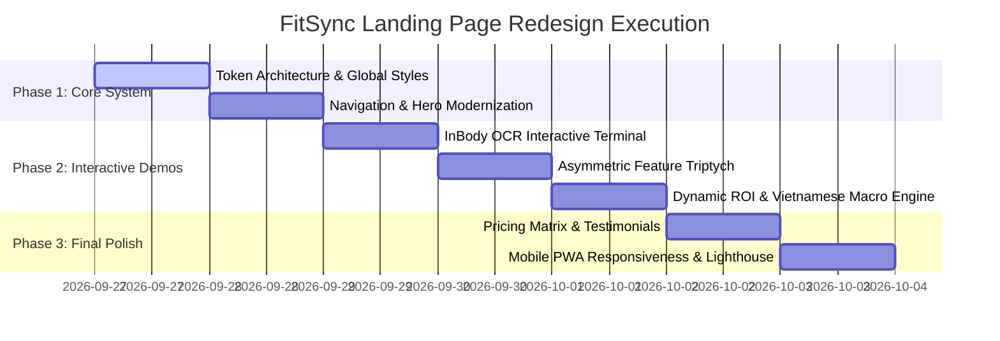

# 🏆 FitSync Master Landing Page Redesign & Architecture Strategy Report

> **Document Version:** 2.0.0
> **Status:** Architecture Approved & Design Strategy Baseline
> **Target Alignment:** EXE201 PRD, `fitsync-docs/`, and Modern 2026 SaaS Benchmarks
> **Core Slogan:** *"Less Admin. More Coaching."*

---

## Executive Summary

The initial landing page suffered from the **"Boring Office Spreadsheet Trap"**: flat pure white backgrounds (`#FFFFFF`), plain tabular layouts, low visual energy, and lack of tangible product interaction. For personal trainers and private gym coaches—who work in high-energy, physical, results-driven environments—this failed to inspire trust or convey modern technological sophistication.

This report synthesizes deep architectural research from industry leaders (**Everfit, Trainerize, Whoop**) and top-tier SaaS engineering benchmarks (**Linear, Raycast, Supabase**) to transform FitSync into a **world-class, high-converting, dark-athletic SaaS platform**.

---

## Part 1: Architecture & Platform Strategy (Web vs. Mobile App)

### 1.1 The User's Core Question
> *"Is this website also the web for PT use on here and also the App when make it into the App like on Android and iOS? A proper app? Or should we have a separate repo for it?"*

### 1.2 Recommended 2-Phase Architecture

```
                               ┌────────────────────────────────────────────────────────┐
                               │                    FitSync Ecosystem                   │
                               └────────────────────────────────────────────────────────┘
                                                           │
                      ┌────────────────────────────────────┴────────────────────────────────────┐
                      ▼                                                                         ▼
     ┌──────────────────────────────────┐                                     ┌──────────────────────────────────┐
     │      PHASE 1: UNIFIED REPO       │                                     │     PHASE 2: NATIVE EXPANSION    │
     │          `fitsync-app/`          │                                     │         `fitsync-mobile/`        │
     │      (Next.js 14 App Router)     │                                     │     (Expo / React Native App)    │
     └──────────────────────────────────┘                                     └──────────────────────────────────┘
                      │                                                                         │
       ┌──────────────┼──────────────┐                                           ┌──────────────┼──────────────┐
       ▼              ▼              ▼                                           ▼              ▼              ▼
  Marketing      Smart PT Hub   Client Portal                              Native Camera   Apple Health   Hardware BT
Landing Page    (Desktop/Tablet) (Mobile PWA)                               + OCR Capture   & Google Fit    InBody Sync
    (`/`)          (`/coach`)      (`/client`)                             (App Store/Play) (Background)  (Smart Scales)
```

#### Phase 1: Unified Next.js Repository (`fitsync-app/`) — **Current MVP**
1. **Public Marketing Landing Page (`/`):**
   - High-converting landing page optimized for SEO, speed, and conversion.
   - Interactive demos, InBody OCR simulator, and dynamic ROI calculator.
2. **Smart PT Hub (`/coach` or `/pt`):**
   - Desktop and tablet-optimized CRM dashboard for personal trainers.
   - Batch client roster, inactivity alerts, session pack tracking, and InBody OCR verification tables.
3. **Trainee Portal (`/client` or `/portal`):**
   - Built as a **Mobile-First Progressive Web App (PWA)** using Web App Manifest and Service Workers.
   - Trainees add `fitsync.vn` to their iOS or Android home screen with a single tap.
   - **Why PWA for Phase 1?**
     - **Zero App Store Friction:** Trainees don't need to download a 100MB app from the App Store just to check their daily calories.
     - **No 30% Apple/Google Tax:** Subscription billing goes through VNPay/VietQR directly.
     - **Instant Code Updates:** Fix bugs or launch features instantly without waiting 3 days for App Store review.

#### Phase 2: Dedicated Native App Repository (`fitsync-mobile/`) — **Scale Phase**
- When the business scales and requires:
  - Background Bluetooth connectivity to digital scales.
  - Native iOS HealthKit / Android Health Connect biometric sync.
  - Hardware camera frame stabilization for real-time OCR.
  - System-level push notifications for missed workouts.
- **Repository Strategy:** Initialize a separate repo `fitsync-mobile/` (React Native / Expo) that consumes the shared REST APIs documented in `fitsync-docs/docs/02-architecture/API_SPECIFICATION.md`.

---

## Part 2: Market & Competitor Research Benchmarks

### 2.1 What the Top SaaS Platforms Do Right

| Platform | Primary Aesthetic | Key Conversion Mechanism | What FitSync Adopts |
| :--- | :--- | :--- | :--- |
| **Everfit** | Clean Athletic Dark / White Hybrid | Visual Autoflow builder preview, client mobile mockups, white-label proof | Mobile mockup preview with real client macro ring & InBody trajectory |
| **Linear** | Techno-Futurist Charcoal (`#08090C`) | "Product-is-the-demo" live interface, keyboard shortcuts, micro-interactions | Hairline 1px borders, subtle amber glow, high-density data typography |
| **Supabase** | Dark Architectural with Emerald Accent | Interactive SQL & terminal pipeline demo right on landing page | Live OCR Terminal Simulator: Upload → Preprocess → OCR → Macro output |
| **Whoop** | Athletic High-Performance Dark | Strain & recovery rings, biometric data storytelling | Biometric cards with Skeletal Muscle Mass (SMM) & Body Fat (PBF) telemetry |

### 2.2 Why the Previous Design Failed & The Solution

```
┌────────────────────────────────────────┐       ┌────────────────────────────────────────┐
│             BEFORE (FLAT)              │       │          AFTER (CARBON ATHLETIC)       │
├────────────────────────────────────────┤       ├────────────────────────────────────────┤
│ ❌ Pure white (#FFFFFF) blinding canvas │  ───> │ ✅ Deep Anthracite (#0A0A0E) base      │
│ ❌ Static text boxes & feature bullets │  ───> │ ✅ "Product-is-the-Demo" Hero Mockup  │
│ ❌ Looked like a school spreadsheet   │  ───> │ ✅ Rich data telemetry & biometric rings│
│ ❌ No emotional connection for PTs     │  ───> │ ✅ High-energy Amber Gold (#F5A623)    │
│ ❌ Cluttered generic buttons           │  ───> │ ✅ Single high-contrast conversion CTA │
└────────────────────────────────────────┘       └────────────────────────────────────────┘
```

---

## Part 3: Design Tokens & Visual System Architecture

Following the mandatory AG Kit Design Protocol and `fitsync-app/DESIGN.md`, the design direction is **"Carbon Interface" (Dark Athletic Data-Forward)**:

### 3.1 Color Palette Tokens
- **Canvas Base:** `#0A0A0E` (Deep Charcoal with warm undertone, not cold blue-black).
- **Surface Elevation 1 (Cards):** `#121217` with `border: 1px solid rgba(255, 255, 255, 0.08)`.
- **Surface Elevation 2 (Active/Hover):** `#181820` with `border: 1px solid rgba(245, 166, 35, 0.25)`.
- **Brand Primary (Energy & Action):** Amber Gold `#F5A623` (Warm, trustworthy, energetic, high contrast).
- **Health / Success (Biometrics):** Seafoam Emerald `#10B981` (SMM gains, hydration, positive progress).
- **Attention / Warning (Inactivity Alerts):** Coral Tangerine `#F97316` (Clients inactive $\ge 3$ days).
- **Alert / Overdue:** Crimson Rose `#EF4444` (Depleted session packs).
- **Text Primary:** `#F3F4F6` (96% Ivory Off-white for zero eye fatigue).
- **Text Secondary / Muted:** `#9CA3AF` (Balanced contrast, WCAG AAA compliant).

### 3.2 Typography System
- **Headings:** `Space Grotesk` or `Outfit` — Sharp geometric sans with athletic technical presence.
- **Body & Controls:** `Inter` or `Geist` — Optimized for readability on mobile and high-density screens.
- **Biometric Numbers & Telemetry:** `JetBrains Mono` / `font-mono` with `tabular-nums` for rock-solid data alignment.

---

## Part 4: Section-by-Section Redesign Specifications

### Section 1: Navigation Bar (`LandingNav.tsx`)
- **Aesthetic:** Floating glass pill (`backdrop-blur-md bg-[#0A0A0E]/80 border border-white/10`).
- **Elements:**
  - Left: FitSync Logo with glowing amber lightning bolt (`FitSync ⚡`).
  - Center: Clean anchor links: *Features*, *Interactive OCR*, *ROI Calculator*, *Pricing*, *Mobile PWA*.
  - Right: "Login" (ghost) + "Start Free 30-Day Pro" (Amber gradient button with subtle glow).

### Section 2: Hero Section with Live Dynamic Mockup (`HeroSection.tsx`)
- **Headline Architecture:**
  - Sub-badge: `🔥 BUILT SPECIFICALLY FOR VIETNAMESE PERSONAL TRAINERS & STUDIOS`
  - H1: **"Less Admin. More Coaching."** (Oversized 56–72px, bold, tight letter spacing, gradient accent on "More Coaching").
  - Subtitle: *"Eliminate 10+ hours of weekly spreadsheet hell. Scan InBody sheets in 5 seconds, auto-calculate Vietnamese meal macros, and keep clients motivated with zero manual typing."*
- **Primary CTAs:**
  - `[⚡ Start 30-Day Free Pro — Zero Card Needed]`
  - `[▶ Try Live Scan Simulator]`
- **Social Proof Metric Strip:**
  - `104+ Active Coaches in HCMC & Hanoi`
  - `90% Time Saved per Client Onboarding`
  - `< 60s From Scan to Macro Plan`
- **Hero Centerpiece (Tilted 3D Dashboard Mockup):**
  - Interactive dual-device preview:
    - **Left (Desktop Mock):** Coach Hub showing today's client roster, red-flag inactivity alert for "Linh Nguyen (3 days inactive)", and session pack countdown.
    - **Right (Mobile PWA Mock):** Trainee smartphone screen showing daily macro progress ring (Protein: 140g / Carbs: 180g / Fats: 45g) with photo check-in.

### Section 3: The Interactive InBody OCR Live Simulator (`OCRDemoSection.tsx`)
- Rather than a passive screenshot, provide a **functional interactive sandbox**:
  1. **Source Selection:** Toggle between *Sample InBody 270 Slip*, *InBody 370 Scan*, and *Custom Upload*.
  2. **Pipeline Animation:** 4-stage sequential progress indicators:
     - `1. Image Normalization & De-skew` (Done - 0.4s)
     - `2. Computer Vision Crop (5 Biometrics)` (Done - 0.8s)
     - `3. OCR Extraction & Validation` (Done - 1.2s)
     - `4. Macro & Calorie Engine Calculation` (Instant)
  3. **Live Verification Grid:** Displays extracted metrics (Weight: 68.4 kg, SMM: 31.2 kg, PBF: 18.5%, BMR: 1,540 kcal) in editable tabular cells with real-time target macro regeneration!

### Section 4: Asymmetric Feature Showcase ("The Triptych" - `FeaturesSection.tsx`)
- Replaces the generic 3-column box layout with an **asymmetric high-impact grid**:
  - **Card 1 (55% Width - Primary Hero):** **AI InBody & Scale OCR Scanner**. Live scanning animation showing automatic conversion from physical printout into digital biometrics and Vietnamese meal plan presets (Phở, Cơm tấm, Bún bò).
  - **Card 2 (45% Width):** **Smart Inactivity Radar & Churn Prevention**. Shows automated alerts triggered when a trainee hasn't checked in for 3 days, with 1-click Zalo follow-up templates.
  - **Card 3 (35% Width):** **Session Pack Depletion & Renewal Tracker**. Automatically alerts the coach when a client reaches 3 sessions remaining, prompting renewal before sessions expire.
  - **Card 4 (65% Width):** **Client Mobile PWA Experience**. No App Store download required; QR-code onboarding in under 15 seconds.

### Section 5: Real-World ROI Calculator (`ROICalculator.tsx`)
- Interactive slider: **"How many active 1-on-1 clients do you train?"** (Slider: 5 to 50 clients).
- Dynamic calculations tailored to the Vietnamese market:
  - **Hours Saved per Month:** `Clients × 1.5 hrs/week × 4 weeks`
  - **Monthly Extra Earning Potential:** `(Hours Saved ÷ 10 hrs per new client) × 2,500,000 VND PT fee`
  - **Annual Value Generated:** Displayed in Millions of VND.
  - Clear comparison: *"FitSync Pro costs 199,000 VND/mo. Your estimated return is 8,200,000 VND/mo (41x ROI)."*

### Section 6: Transparent Pricing Matrix (`PricingSection.tsx`)
- Monthly / Annual toggle (Annual saves 20% + 2 free months).
- Three clearly tiered cards:
  1. **Starter Coach:** 99,000 VND / month (Up to 8 clients, 30 OCR scans/mo).
  2. **Pro Coach (Most Popular - Glowing Amber Border):** 199,000 VND / month (Up to 25 clients, unlimited OCR scans, Inactivity Radar, PWA Client Portal).
  3. **Gym Studio / Team:** 499,000 VND / month (Unlimited clients, 5 coach accounts, custom branding, CSV export).

### Section 7: Social Proof, FAQ & High-Conversion Footer (`Footer.tsx`)
- Authentic coach testimonials from early beta users in District 1 & 7, Ho Chi Minh City.
- Collapsible FAQ addressing:
  - *"Does FitSync work with InBody 270 and 370?"*
  - *"Can my clients install this on iPhone without Apple App Store?"*
  - *"What happens if the scan is blurry?"*
- Sticky bottom mobile banner for mobile visitors: `[Get Early Access — Free 30 Days]`.

---

## Part 5: Implementation Roadmap



---

## Part 6: Complete Codex Handoff Prompt

*(Copy and paste the prompt in Part 6 directly into your new Codex or AI chat session to execute the implementation immediately.)*
